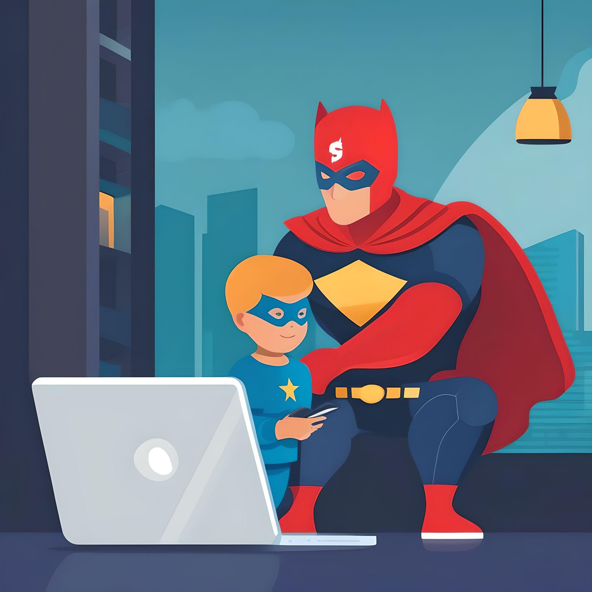

# Payment Gateways
_**Payment gateways**_ act as superheroes 🦸‍♂️, making online purchases easy and secure! :joy: Imagine you want to buy an online game 🎮. These superheroes spring into action, hiding your payment information from any _prying eyes_ 🏴‍☠️ on the web 🌐, as ths information is like powerful jewelry and must be protected! Once everything is secure, these guardians move the money from the place you save it to the store where you bought the game, almost like magic! This seamless process enables people worldwide to make purchases using their phones 📱, computers 💻, and more, all without leaving the comfort of their homes 🏠.

Before _**payment gateways**_ came along, buying things online was really tricky :tired_face:. If you wanted to buy something from another country, you'd have to travel there, which made everything more expensive :moneybag:. But now, thanks to these superheroes, it's like the whole world is connected by a special magic path :airplane:, making buying things faster and easier than ever before. So now, no matter where you are, buying stuff online feels like a superpower!

